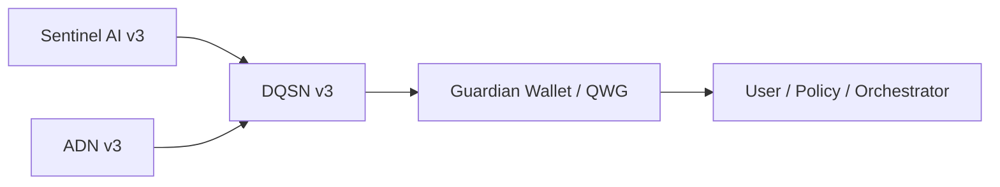
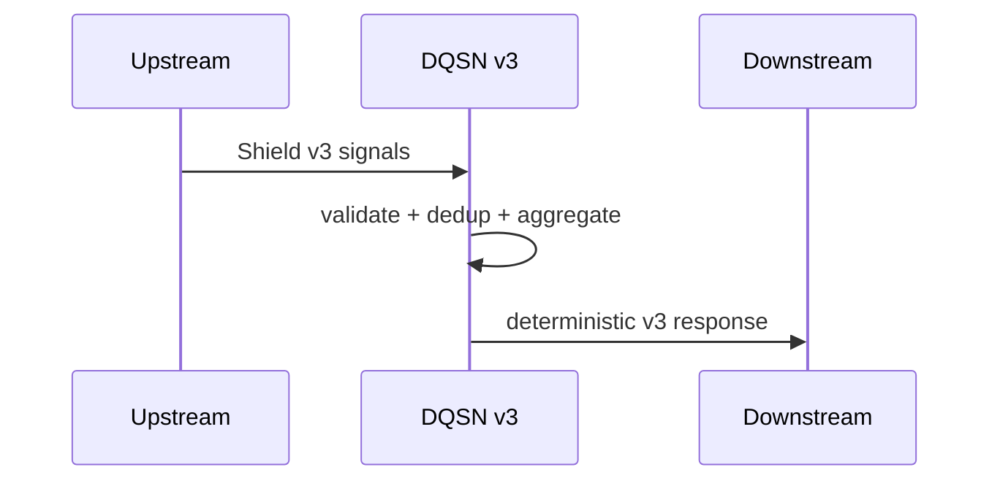

# 🔷 DigiByte Quantum Shield Network (DQSN)


**Shield Contract v3 • Deterministic Aggregation • Fail-Closed Security**

DQSN is the **network-level aggregation layer** of the DigiByte Quantum Shield.
It consumes **read-only Shield Contract v3 signals**, validates and deduplicates them,
and emits a **deterministic v3 response** for downstream decision layers.

> DQSN aggregates signals.  
> Higher layers decide and act.

---

## 📌 Status

- **Version:** Shield Contract v3
- **CI:** ✅ Passing
- **Coverage:** ≥ 90% enforced
- **State:** Contract-locked and complete

This repository contains the **authoritative DQSN v3 implementation**.

---

## 🧭 Role in the Quantum Shield



DQSN sits **between sensors and decision layers**.
It never executes actions and never mutates state.

---

## 🧱 Architectural Guarantees

DQSN v3 guarantees:

- strict schema validation (deny unknown keys)
- fail-closed behavior on ambiguity
- deterministic output and hashing
- stable reason codes
- no timestamps, randomness, or side effects

If input is invalid, output is **deterministically ERROR**.

---

## 🗂 Repository Layout

```
dqsnetwork/
├─ v3.py                  # canonical aggregation entrypoint
├─ contracts/             # Shield Contract v3 definitions
│  ├─ v3_types.py
│  ├─ v3_hash.py
│  └─ v3_reason_codes.py
├─ v3_api.py              # optional FastAPI wiring
└─ ...
legacy/
└─ historical prototypes (non-authoritative)
docs/
└─ authoritative documentation
```

Only code under `dqsnetwork/` is authoritative for v3 behavior.

---

## 🔐 Determinism Model



Identical input → identical output. Always.

---

## 📚 Documentation

Start here:

- `docs/ARCHITECTURE.md` — design and authority boundaries
- `docs/INDEX.md` — documentation map
- `docs/DQSN_V3_UPGRADE_PLAN.md` — completed upgrade record

---

## ⚠️ Authority Rule

If documentation and code disagree,  
**the code in `dqsnetwork/` wins.**

---

## 🧾 License

MIT License  
© DarekDGB and contributors
