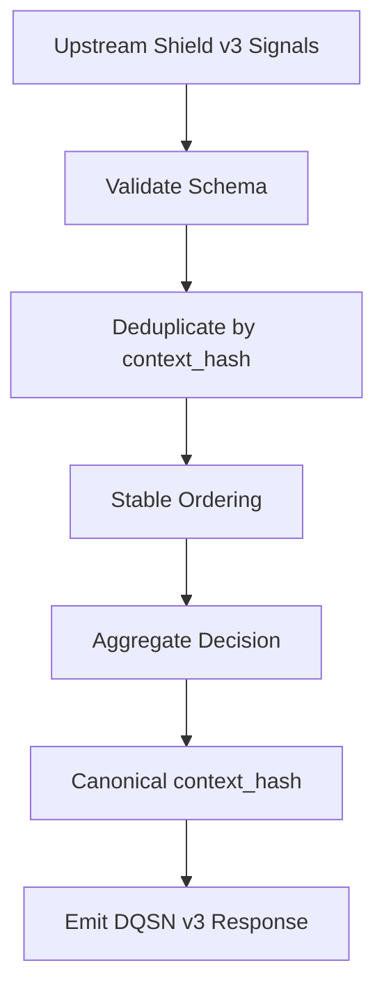
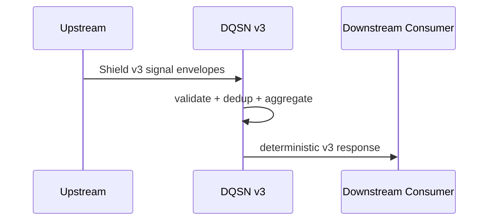

# DigiByte Quantum Shield Network (DQSN)
## Architecture — Shield Contract v3

---

## 1. Purpose and Role

DQSN is the **network-level aggregation layer** in the DigiByte Quantum Shield.

Its sole responsibility is to ingest **read-only Shield Contract v3 signals**
from upstream components, validate them, deduplicate them, and produce a
**deterministic Shield Contract v3 response** for downstream consumers.

DQSN does **not** execute actions.
DQSN does **not** mutate wallet or node state.
DQSN does **not** reinterpret upstream meaning.

It aggregates — nothing more.

---

## 2. Non-Goals (Explicit)

DQSN does **not**:

- sign or broadcast transactions
- hold or derive keys
- alter consensus or node state
- enforce wallet policy
- perform adaptive learning
- issue commands to other layers

All enforcement and learning happens **outside** DQSN.

---

## 3. Authoritative Code Surface

The following paths are **authoritative for DQSN Shield Contract v3 behavior**:

- `dqsnetwork/v3.py`
  - canonical entrypoint: `DQSNV3.evaluate`
- `dqsnetwork/contracts/`
  - `v3_types.py` — schema validation
  - `v3_hash.py` — canonical hashing
  - `v3_reason_codes.py` — stable reason codes

If documentation or legacy code conflicts with these files,
**these files win**.

---

## 4. Legacy Code (Non-Authoritative)

- `legacy/`

This directory contains historical prototypes and research code.
It is preserved for reference only.

Legacy code:
- is **not imported** by v3
- is **not part of the contract**
- has **no authority**

---

## 5. High-Level Data Flow

---

## 6. Deterministic Aggregation Model

DQSN output is deterministic by design:

- canonical JSON serialization
- stable ordering where defined
- no timestamps
- no randomness
- no environment-dependent state

Identical input always produces identical output.

---

## 7. Failure Model (Fail-Closed)

DQSN is **fail-closed**.

Any ambiguity or invalid input results in:

- `decision = ERROR`
- a stable reason code
- a deterministic error hash

Examples include:
- invalid schema
- malformed numeric values (NaN / Inf)
- unknown top-level keys
- oversized payloads

---

## 8. Integration Expectations

**Upstream components must:**
- emit Shield Contract v3 envelopes
- provide stable `context_hash`
- avoid side effects

**Downstream components must:**
- treat DQSN output as contextual input
- make final decisions independently

DQSN never issues commands.

---

## 9. Architectural Invariant

> DQSN aggregates information.  
> Higher layers decide and act.

This invariant must never be violated.
